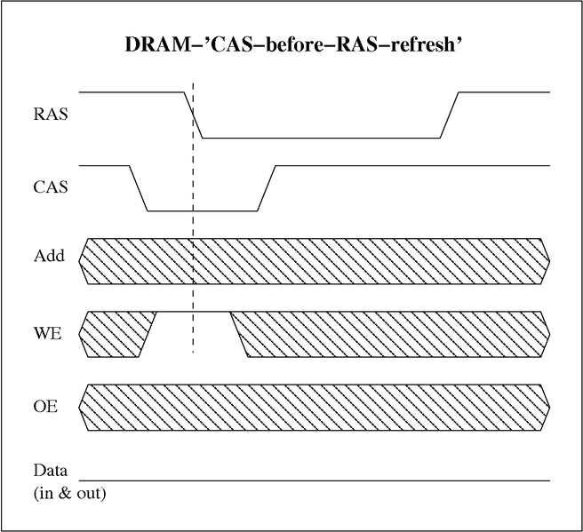

***Seraya Takahashi, Paolo De Giglio***

# Informatik 3, Uebungsserie 4

## Side Notes
- RAM := Random Access Memory
    - Random := Jede Information/Byte kann innert einer konstanten Zeit abgefragt werden, unabhängig von der Position im Speicher und Abhängigkeiten zur zuvor abgefragten Information/Byte
- SRAM := Static RAM
    - benötigt 2-4 Transistoren/Bit
    - SRAM-Transistoren können Informationen beliebig lange speichern, solange sie unter Spannung stehen (kein Refresh wird benötigt).
- DRAM := Dynamic RAM --> heute verwendete Arbeitsspeicher-Technologie
    - benötigt 1 Tranistor/Bit
    - kleinere Speicherzellen als bei SRAM --> spart Platz
    - aber: deutlich langsamer als SRAM
    - und: benötigt Refreshs (i.d.R. alle 32 v 64ms) , wegen Leckströmen, welche in Kondensatoren gespeicherte Ladungsmenge verändern kann
    - Refresh-Analogie: Kübel mit Löcher, gefüllt mit Wasser, welcher in einem bestimmten Intervall wieder gefüllt werden muss (repräsentiert ein Bit, welches true=1 ist), bevor das ganze Wasser ausgelaufen ist. DRAM-Transistoren verhalten sich genau gleich, da die Spannung nur kurz zwischengespeichert werden kann. Bevor die Spannung verlohren geht, muss der Transistor daher erneut aufgeladen werden.
- SDRAM := Synchronized DRAM
    - Synchronizes := welcher mit dem Systembus synchronisiert ist: Das SDRAM-Interface wartet auf das Clock-Signal des Buses, bevor es die Inputs verarbeitet.
    - Die Befehle werden zudem via Pipeline übermittelt.
    - Daher kann der Chip einen komplexeren Befehlssatz verarbeiten, was ihn
    - schneller als DRAM macht

### Links
http://taututorial.yolasite.com/sdram.php

## 1. Die Zugriffszeiten unterschiedlicher Speicherarten beeinflussen erheblich die Leistung aktueller Computer bzw. Prozessoren.
###a) Recherchieren Sie aktuellen Werte für die Zugriffszeiten in Rechnern (Lesen und Schreiben) für
- SRAM(1st-Level-Cache)
- DRAM(Arbeitsspeicher)
- Festplatten(Massenspeicher)und
- SolidStateDisks(alsMassenspeicher)
(Bitte mit Quellenangabe belegen – 4 Punkte)

**Lösung:**

- SRAM --> 10ns (http://www.webopedia.com/TERM/A/access_time.html)
- DRAM --> 50-150ns (http://www.webopedia.com/TERM/A/access_time.html)
- HD   --> 1000ms (http://www.webopedia.com/TERM/A/access_time.html)
- SSD  --> 30ns/30ns (http://www.tomshardware.com/charts/ssd-charts-2013/AS-SSD-Write-Access-Times,2789.html http://www.tomshardware.com/charts/ssd-charts-2013/AS-SSD-Read-Access-Times,2788.html)

###b) Was sind die Vorteile und Nachteile der DDR(x)-SDRAM Speicherbausteine (x steht für leer, 2 und 3) gegenüber klassischen DRAM-Bausteinen?

**Lösung:**

Im Gegensatz zu DRAM-Bausteinen sind SDRAM-Bausteine mit dem Systembus gesynct. Hierbei wartet das SDRAM-Interface auf den Clock des Buses, um dann die Befehle zu verarbeiten. Die Befehle werden via Pipeline übermittelt. Daher kann der Chip einen komplexeren Befehlssatz verarbeiten, was ihn schneller als DRAM macht. Unterschiede zwischen den verschiedenen DDR(x) Varianten sind hauptsächlich, wie oft ein „Prefetch“ asugeführt wird. D.h., wie oft Daten geladen werden, bevor sie tatsächlich benötigt werden. Dies kommt auch beim beim Pipelining zum Einsatz. DDR => 2x Prefetch, DDR2 => 4x Prefetch, DDR3 => 8x Prefetch

## 2. Durch eine Speicherhierarchie soll der Benutzer sehr grossen Speicher zu sehr günstigen Kosten (virtuell) nutzen können.
### a) Geben Sie die folgende aktuellen Grössenordnungen für ein SRAM, DRAM, Harddisk, Bandlaufwerk und DVD an:
- Kosten pro MB
- Zugriffsgeschwindigkeit auf ein einzelnes Byte (das erste Byte)
- Durchsatz

**Lösung:**

| Medium        | Kosten/MB   | v Zgr.   | Durchsatz |
| ------------- |:-----------:| --------:| ---------:|
| SRAM          | 300 Fr.     | 5ns      | MB/s      |
| DRAM          | 1.29 Rp.    | 41.6 ns  | GB/s      |
| Harddisk      | 0.04 Rp.    | 3.4 ms   | GB/s      |
| Bandlaufwerk  | 0.004 Rp.   | 80s      | MB/s      | 
| DVD           | 1.6 Rp.     | 9ms      | MB/s      |

[1] ..
[2] https://www.digitec.ch/ProdukteDetails2.aspx?Reiter=Bilder&Artikel=257449
[3] https://www.digitec.ch/ProdukteDetails2.aspx?Reiter=Bilder&Artikel=180978 (SAS HD)
[4] https://www.digitec.ch/ProdukteDetails2.aspx?Reiter=Bilder&Artikel=271173 (LTO-6)
[5] https://www.digitec.ch/ProdukteDetails2.aspx?Reiter=Bilder&Artikel=114112 (DVD-R 16x)

## 3. Die häufigste Speichertechnologie für den Arbeitsspeicher sind aktuell noch DRAMs. Ein Nachteil der DRAM-Technologie ist u. a. der häufig erforderliche Refresh.
### a) Zeigen Sie anhand der beigefügten schematischen Skizze einer einzelnen DRAM-Zelle, warum ein Refresh erforderlich ist und wie dieser abläuft. 

**Lösung:**

- Bei DRAM-Transistoren kann die Ladung nur für eine bestimmte Zeit zwischengespeichert werden, weil sie die Ladung mit der Zeit wieder verlieren. Um dieses Problem in den Griff zu bekommen, müssen daher in regelmässigen Abständen (i.d.R. alle 32 oder 63 ms) die Stände überprüft und neu gesetzt bzw. die Transistoren voll aufgeladen werden, um eine klare Unterscheidung zwischen true und false machen zu können. In den meisten der heutigen Computer werden DRAMs verbaut, welche "CAS before RAS Refresh" (CBR Refresh) nutzen, um die Transistoren zu refreshen. Hierbei wird die Zeilenadresse nicht extern verwaltet, da dies durch die Implementierung eines Zeilenzählers im Speicherbaustein entfällt. Ein Refreshzyklus beginnt mit einer fallenden Flanke an CAS und wird danach an RAS durch steigende Flanken an beiden Steuerleitungen beendet. Da gegenüber dem Normalbetrieb die Steuersignale in vertauschter Reihenfolge übermittelt werden, erkennt der DRAM, dass es sich um einen Refreshzyklus handeln muss. Gegenüber dem Standartverfahren ist das CBR-Refresh-Verfahren schneller, weil die Übergabe der Zeilenadresse entfällt. Der Prozess wird lediglich von aussen angestossen. Die Grafik veranschaulicht den Vorgang eines CBR Refreshes anhand eines EDO-RAMs, welcher zur Gruppe der DRAMs gehört.

***Legende:***

- CAS := Column Access Strobe (hierbei wird eine Spalte aus der Speicherzelle ausgelesen)
- RAS := Row Access Strobe (hierbei wird eine Zeile aus der Speicherzelle ausgelesen)

