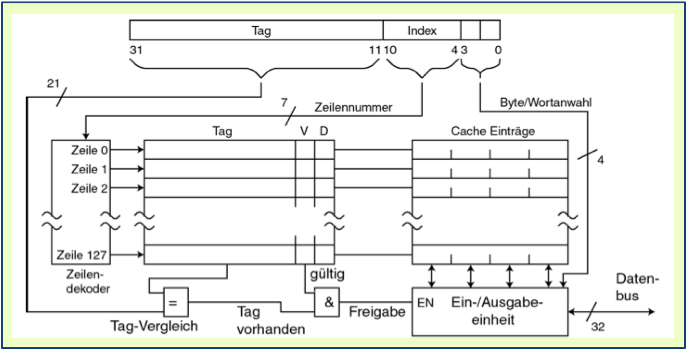

***Seraya Takahashi, Paolo De Giglio***

# Informatik 3, Uebungsserie 5

## 1. Ein Cache eines Prozessors kann die notwenige Bearbeitungszeit für ein Programm erheblich reduzieren
### a) Welche Eigenschaften von Programmen (und Datenstrukturen) nutzt dabei ein Cache aus?
Lösung: Compiler und Programme, die das Prinzip der Lokalität (zeitlich, aber auch räumlich) unterstützen, können erheblich den Programmablauf beschleunigen.

### b) Geben Sie je zwei Programmbeispiele an, die die Effizienz eines Caches unterstützen bzw. nicht unterstützen?

Lösung:

- Positivbeispiele: kleinere Schleifen, viele Zugriffe auf dieselben Daten auf dem Arbeitsspeicher, Befehlsfolgen, auf Cache optimierte Compiler/Programme/OS
- Negativbeispiele: Bisher nicht verwendete Daten, Laden des nächsten Programmbefehls bei weiten Sprüngen, Massenverarbeitung von Daten, nicht auf Cache optimierte Compiler/Programme/OS

## 2. Betrachtet werden zwei Prozessoren mit einer Zykluszeit von 2 ns: ein Prozessor Pa ohne Cache und ein Prozessor Pb mit Cache. Für ein Programm wird bei jedem 3. Befehl auf den Speicher zugegriffen. Die Zugriffszeit auf ein Datum im Arbeitsspeicher beträgt die 50 ns, die CPI für die anderen Befehle 2.5.

### a) In welcher Zeit wird ein Befehl des Programms mit dem Prozessor Pa durchschnittlich bearbeitet? (näherungsweise)

Lösung:

- Geg.:
    - CPI = 2.5
    - tc = 2ns
    - As = 1/3
    - ts = 50ns
- Rechnung:
    - t = (1 - As) * tc + As * ts = (1 - 1/3) * (2.5 * 2ns) + 1/3 * 50ns = 20ns

### b) In welcher Zeit wird ein Befehl des Programms mit dem Prozessor Pb durchschnittlich bearbeitet, wenn folgendes gilt: Rhit = 96%, thit = 2 ns thit =2ns und tmiss=70ns?

Lösung:

- Geg.:
    - Rhit = 96%
    - thit = 2ns
    - tmiss = 70ns
- Rechnung:
    - t = (1 - As) * tc + As * (Rhit * thit + (1 - Rhit) * tmiss) = (1 - 1/3) * (2.5 * 2ns) + 1/3 * (0.96 * 2ns + (1 - 0.96) * 70ns) = 4.907ns

### c) Um wie viel % steigert der Cache des Prozessor Pb die Rechen- leistung?
- Lösung:
    - (tohneC/tmitC)-1 = 307%

## 3. Gegeben sei ein Rechner mit 28 Byte Arbeitsspeicher und einem 16-Byte grossem direktabbildenden Cache (Blockgrösse 2 Wörter; Wortgrösse 1 Byte).
### a) Geben Sie an, welche Byte (bzw. Blöcke) des Arbeitsspeicher auf welche Position im Cache abgebildet werden.

Lösung:

- Geg.:
    - Cache-Adr. = Block-Adr. % (∑ Blöcke im Cache)
    - Blockgr. = 2 W
    - Wortgr. = 1 Byte
    - RAM = 28 Byte
    - Cache = 16 Byte
- Rechnung: 
    - Cache-Adr. = Block-Adr. % (∑ Blöcke im Cache) = B % (16/2*1)

| Adresse RAM    | Adresse Cache | 
| -------------- |:-------------:|
|  0,8,16,..,256 | 0             |
|  1,9,17,..,249 | 1             |
| 2,10,18,..,250 | 2             |
| 3,11,19,..,251 | 3             |
| 4,12,20,..,252 | 4             |
| 5,13,21,..,253 | 5             |
| 6,14,22,..,254 | 6             |
| 7,15,23,..,255 | 7             |

### b) Während eines Programmablaufs kommt es zum Zugriff auf folgende Byte im Arbeitsspeicher (in dieser Reihenfolge): ... 3, 4, 5, 6, 100, 101, 2, 3, 4, 5, 6, 51, 102, 105, 5, 6, ... (Annahme: Cache ist leer)

###- Geben Sie an, wann welcher Block in den Cache übertragen wird

###- Wie häufig muss auf den (langsameren) Arbeitsspeicherzugegriffen werden, wie häufig reicht der Zugriff auf den Cache aus?

| Adr. | Zugr. RAM | Cache Adr. |
| ---- |:---------:|:----------:|
|    3 |         3 |          3 |
|    4 |         4 |          4 |
|    5 |         5 |          5 |
|    6 |         6 |          6 |
|  100 |       100 |          4 |
|  101 |       101 |          5 |
|    2 |         2 |          2 |
|    3 |         - |          3 |
|    4 |         4 |          4 |
|    5 |         5 |          5 |
|    6 |         - |          6 |
|   51 |        51 |          3 |
|  102 |       102 |          6 |
|  105 |       105 |          1 |
|    5 |         - |          5 |
|    6 |         6 |          6 |

- Anz. Zugriffe auf Arbeitsspeicher: 13
- Anz. Zugriffe ohne Arbeitsspeicherzugriff: 3

### c) Nun wird der Cache durch einen 2-fach satzassoziativen Cache ersetzt. Geben sie für die ansonsten gleichen unter b) gegeben Bedingungen an,
- wann welcher Block in den Cache übertragen wird und
- wie häufig auf den (langsameren) Arbeitsspeicher zugegriffen werden muss, bzw. wie häufig der Zugriff auf den Cache ausreicht?

| Adr. | Zugr. RAM | Cache Adr. | Satznr. |
| ---- |:---------:|:----------:|:-------:|
|    3 |         3 |          3 | 1       |
|    4 |         4 |          4 | 1       |
|    5 |         5 |          5 | 1       |
|    6 |         6 |          6 | 1       |
|  100 |       100 |          4 | 2       |
|  101 |       101 |          5 | 2       |
|    2 |         2 |          2 | 1       |
|    3 |         - |          3 | 1       |
|    4 |         - |          4 | 1       |
|    5 |         - |          5 | 1       |
|    6 |         - |          6 | 1       |
|   51 |        51 |          3 | 2       |
|  102 |       102 |          6 | 2       |
|  105 |       105 |          1 | 1       |
|    5 |         - |          5 | 1       |
|    6 |         - |          6 | 1       |

- Anz. Zugriffe auf Arbeitsspeicher: 10
- Anz. Zugriffe ohne Arbeitsspeicherzugriff: 6

## 4. Gegeben sei für einen Rechner der unten dargestellte direktabbildende Cache.

### a) Wie gross ist der Hauptspeicher des Rechners maximal?

Lösung:

- 31 - 11 = 20 => 2^20 = 1'048'576 Bytes

### b) Wie gross ist ein Wort und wie gross ein Block im Cache?

Lösung:

- 1 Block := 4 Wörter à 8 Bit

### c) Wie gross ist der Cache (in Byte)?

Lösung:

- Grösse in Byte = (128) * (4) * (8) Bit = 4096 Bit = 4096/8 Byte = 512 Byte

### d) Wie lautet der Index und der Tag für den Speicher mit der Adresse 01 42 1F F0 (MSb und MSB je links)?

Lösung:

- 01421FF0(hex) = 0000 0001 0100 0010 0001 1111 1111 0000(bin)

| Name |                        Bin |   Dec |
|:----:|:--------------------------:|:-----:| 
| Tag  | 0 0000 0010 1000 0100 0011 | 10307 |
| Index|                   111 1111 |   127 |

### e) Tragen Sie in der Abbildung ein, wo die Speicher mit der Adresse 01 42 1F F0 und 23 77 18 27 im Cache abgebildet werden?

Lösung:

Die Cache-Adresse wird durch den Index der Adresse definiert.

| Name |                        Bin |   Dec |
|:----:|:--------------------------:|:-----:| 
| Tag  | 0 0000 0010 1000 0100 0011 | 10307 |
| Index|                   111 1111 |   127 |

- 01421FF0(hex) = 0000 0001 0100 0010 0001 1111 1111 0000(bin)
- 01421FF0(hex) wird in Zeile 127 abgelegt.

| Name |                        Bin |   Dec |
|:----:|:--------------------------:|:-----:| 
| Tag  | 0 0100 0110 1110 1110 0011 | 290531|
| Index|                   001 1000 |    24 |

- 23771827(hex) = 0010 0011 0111 0111 0001 1000 0010 0111(bin)
- 23771827(hex) wird in Zeile 24 abgelegt.

